# PoW Name Service (PoWNS) Whitepaper

> **Scarcity through Proof of Work, not Capital.**

**Version**: 1.0  
**Date**: December 29, 2025

---

## Abstract

PoW Name Service (PoWNS) is a decentralized naming system based on Proof of Work. Unlike traditional naming services (such as ENS) that rely on "first-come-first-served + capital bidding," PoWNS determines name scarcity through pure computational competition.

**Core Features**:

- **Fair Distribution**: Names belong to whoever completes the PoW first
- **Bounty Market**: Non-mining users can post bounties for others to mine
- **Dynamic Difficulty**: Dark Gravity Wave algorithm for smooth difficulty adjustment
- **NFT-based**: Names exist as ERC-721 tokens, tradable and transferable
- **Native Token**: $POWNS for governance, incentives, and ecosystem closure

---

## Table of Contents

1. [Background & Motivation](#1-background--motivation)
2. [System Design](#2-system-design)
3. [PoW Mechanism](#3-pow-mechanism)
4. [Difficulty Adjustment System](#4-difficulty-adjustment-system)
5. [Domain Lifecycle](#5-domain-lifecycle)
6. [Bounty Market](#6-bounty-market)
7. [Resolver System](#7-resolver-system)
8. [$POWNS Token Economics](#8-powns-token-economics)
9. [Governance](#9-governance)
10. [Ecosystem Expansion](#10-ecosystem-expansion)
11. [Security Analysis](#11-security-analysis)
12. [Roadmap](#12-roadmap)
13. [Conclusion](#13-conclusion)

---

## 1. Background & Motivation

### 1.1 Problems with Existing Naming Systems

| System    | Problems                                                                  |
| --------- | ------------------------------------------------------------------------- |
| DNS       | Centralized, censorable, requires trust in authorities                    |
| ENS       | Highest bidder wins, capital monopoly on short names, fees go to protocol |
| Handshake | TLD auctions are still capital competition                                |

### 1.2 PoWNS Solution

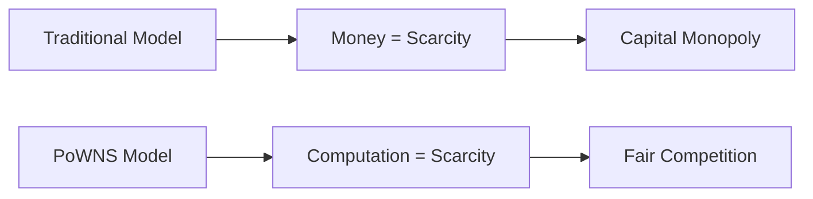

**Design Philosophy**:

1. **Computation determines scarcity**: Names belong to those who invest computational power
2. **Bounty market enables inclusion**: Users who can't mine can participate through bounties
3. **Time earns rights**: Renewal requires continued computational investment
4. **Censorship resistant**: Pure on-chain verification, no centralized control points

---

## 2. System Design

### 2.1 Architecture Overview

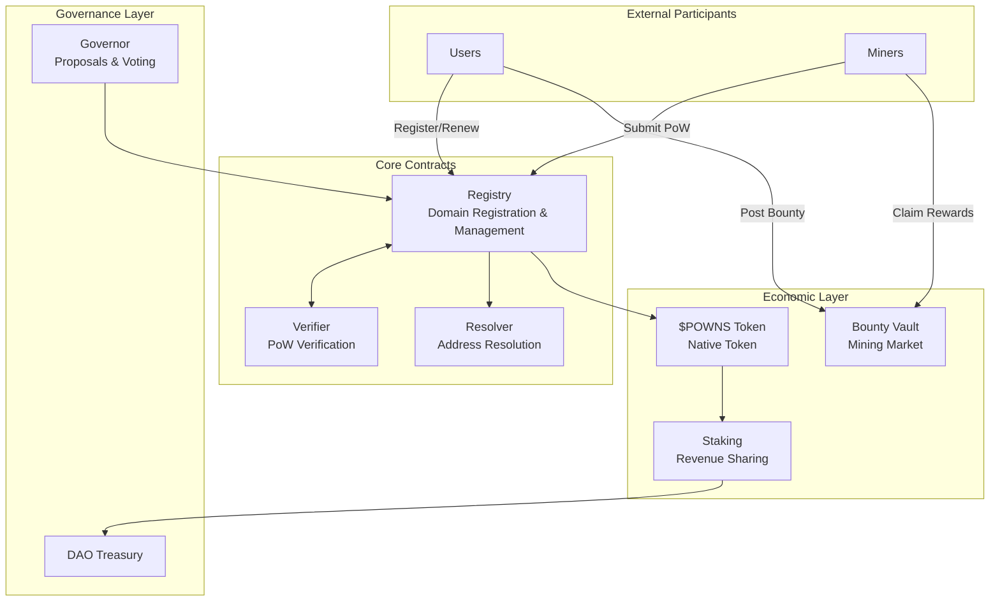

### 2.2 Contract Interface

```solidity
interface IPoWNSRegistry {
    // Register a domain
    function register(
        string calldata name,
        address owner,
        address miner,
        uint256 nonce,
        uint8 years
    ) external;

    // Renew a domain
    function renew(
        string calldata name,
        uint256 nonce,
        uint8 additionalYears
    ) external;

    // Release a domain (refund deposit)
    function release(string calldata name) external;

    // Queries
    function ownerOf(string calldata name) external view returns (address);
    function expiresAt(string calldata name) external view returns (uint256);
    function difficulty(string calldata name) external view returns (uint256);
}
```

---

## 3. PoW Mechanism

### 3.1 Hash Computation

```
hash = SHA256(name || owner || miner || nonce || chainId || registryAddress)
valid = (hash < target)
```

**Parameter Description**:

| Parameter         | Purpose                                                |
| ----------------- | ------------------------------------------------------ |
| `name`            | The domain name to register                            |
| `owner`           | NFT recipient address                                  |
| `miner`           | Transaction submitter address (prevents front-running) |
| `nonce`           | Random number found by miner                           |
| `chainId`         | Prevents cross-chain replay                            |
| `registryAddress` | Prevents contract replay                               |

### 3.2 Why Bind Miner Address?

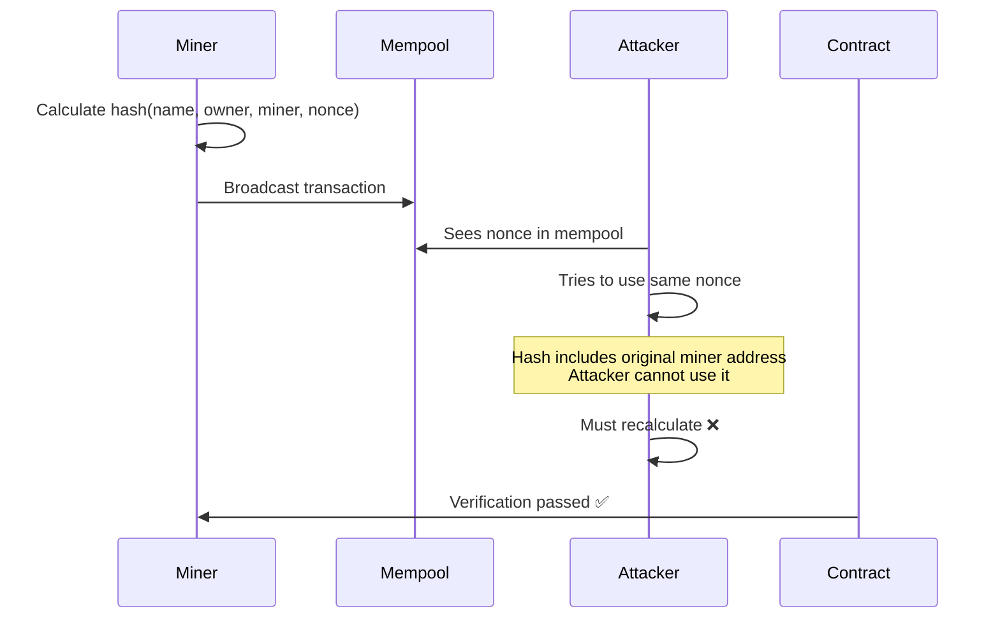

### 3.3 Verification Cost

| Operation          | Gas Cost    |
| ------------------ | ----------- |
| SHA256 hash        | ~60 gas     |
| Target comparison  | ~100 gas    |
| Total verification | ~200 gas    |
| NFT Mint           | ~50,000 gas |

---

## 4. Difficulty Adjustment System

### 4.1 Dark Gravity Wave (DGW)

We adopt the battle-tested Dark Gravity Wave algorithm for smooth and responsive difficulty adjustment.

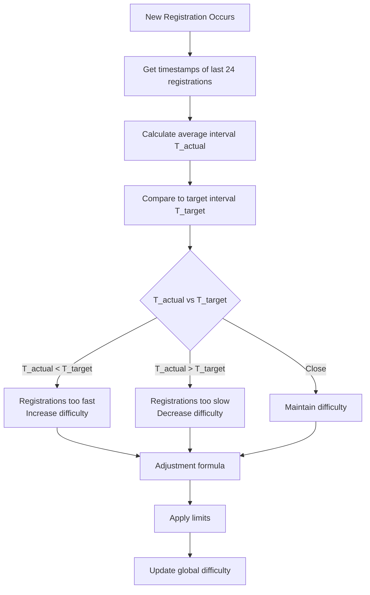

### 4.2 Difficulty Adjustment Formula

```
T_actual = (timestamp[n] - timestamp[n-24]) / 24
adjustment_ratio = T_target / T_actual
difficulty_new = difficulty_old × adjustment_ratio
```

### 4.3 Safety Limits

| Parameter                 | Value                | Description                                  |
| ------------------------- | -------------------- | -------------------------------------------- |
| **Observation Window**    | 24 registrations     | Balance between responsiveness and stability |
| **Target Interval**       | 600 seconds (10 min) | One domain per 10 minutes                    |
| **Max Single Adjustment** | +25%                 | Prevents difficulty spikes                   |
| **Min Single Adjustment** | -25%                 | Prevents difficulty crashes                  |
| **Difficulty Floor**      | MIN_DIFFICULTY       | Ensures minimum computational barrier        |
| **Difficulty Ceiling**    | MAX_DIFFICULTY       | Prevents system freeze                       |

### 4.4 Difficulty Floor Implementation

```solidity
uint256 constant MIN_DIFFICULTY_BITS = 16;  // At least 16 leading zero bits
uint256 constant MAX_DIFFICULTY_BITS = 240; // Maximum difficulty

function adjustDifficulty() internal {
    // ... DGW calculation ...

    // Apply limits
    uint256 maxNew = (currentDifficulty * 125) / 100; // +25%
    uint256 minNew = (currentDifficulty * 75) / 100;  // -25%

    newDifficulty = clamp(newDifficulty, minNew, maxNew);

    // Enforce floor and ceiling
    newDifficulty = max(newDifficulty, MIN_DIFFICULTY_BITS);
    newDifficulty = min(newDifficulty, MAX_DIFFICULTY_BITS);
}
```

### 4.5 Name Weight (Base Difficulty Adjustment)

Different name lengths/types have different base difficulties:

```
base_difficulty_bits = MIN_DIFFICULTY_BITS + length_weight + charset_weight

length_weight:
  - 3 characters: +32
  - 4 characters: +24
  - 5 characters: +16
  - 6 characters: +8
  - 7+ characters: +0

charset_weight:
  - Numeric only: +8
  - Alphabetic only: +4
  - Mixed: +0
```

### 4.6 Old Result Validity

**Principle**: When difficulty decreases, previously valid results remain valid.

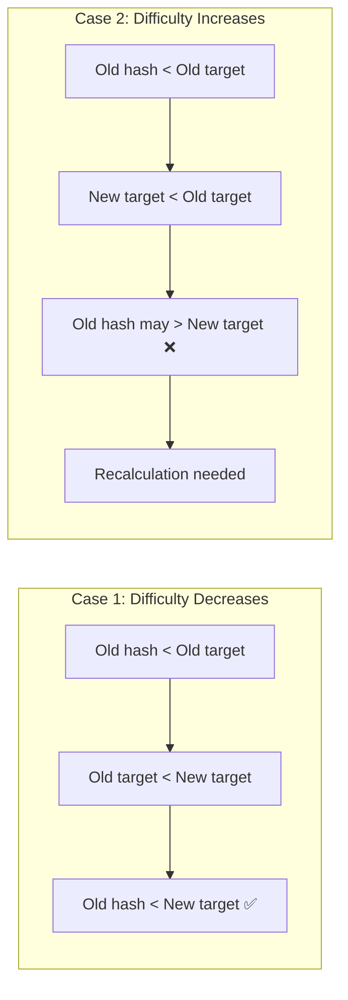

---

## 5. Domain Lifecycle

### 5.1 State Machine

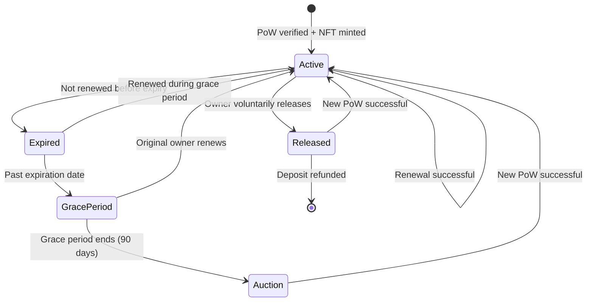

### 5.2 State Descriptions

| State           | Description              | Allowed Actions                        |
| --------------- | ------------------------ | -------------------------------------- |
| **Active**      | Normal ownership         | Set resolver, transfer, renew, release |
| **Expired**     | Just expired             | Only original owner can renew          |
| **GracePeriod** | 90-day grace period      | Only original owner can renew          |
| **Auction**     | Dutch difficulty auction | Anyone can submit PoW                  |
| **Released**    | Fully released           | Anyone can register                    |

### 5.3 Renewal Mechanism

Renewal requires submitting new PoW, with difficulty based on renewal duration:

```
renew_difficulty = current_difficulty × (1 + 0.1 × additional_years)
```

- Renew 1 year: difficulty ×1.1
- Renew 5 years: difficulty ×1.5
- Renew 10 years: difficulty ×2.0

### 5.4 Dutch Difficulty Auction

After grace period ends, domain enters decreasing difficulty auction:

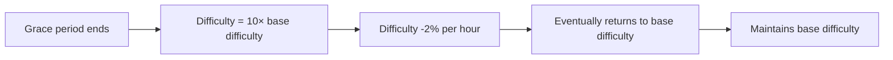

```solidity
function getAuctionDifficulty(string memory name) public view returns (uint256) {
    uint256 baseDiff = getBaseDifficulty(name);
    uint256 elapsed = block.timestamp - auctionStartTime[name];
    uint256 hoursElapsed = elapsed / 1 hours;

    // Starts at 10x, decreases 2% per hour, reaches 1x after ~115 hours
    uint256 multiplier = 1000 - min(hoursElapsed * 20, 900); // 1000 = 10x, 100 = 1x

    return (baseDiff * multiplier) / 100;
}
```

---

## 6. Bounty Market

### 6.1 Overview

Non-mining users can delegate PoW work through the bounty market:

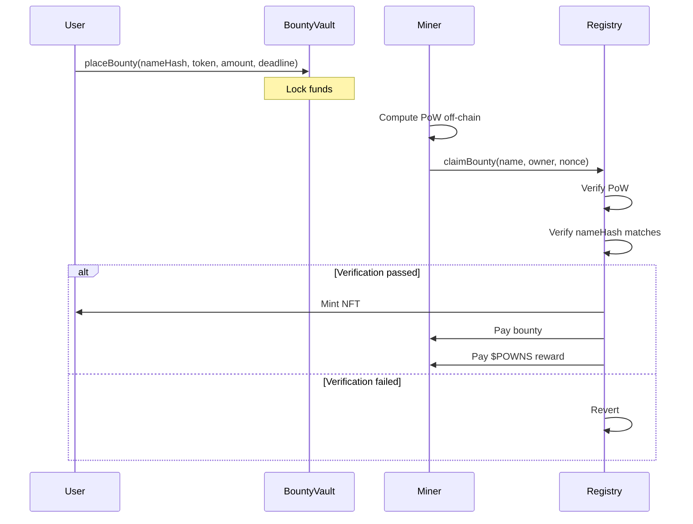

### 6.2 Bounty Structure

```solidity
struct Bounty {
    bytes32 nameHash;       // keccak256(name)
    address owner;          // NFT recipient
    address token;          // Payment token (ETH/USDC/POWNS)
    uint256 amount;         // Bounty amount
    uint256 deadline;       // Expiration time
    uint8 minYears;         // Minimum registration years
    uint256 maxDifficulty;  // Maximum acceptable difficulty (user protection)
}
```

### 6.3 Front-running Protection

Since the hash is bound to the `miner` address:

- Nonces calculated by Miner A can only be submitted by Miner A
- Even if seen by MEV bots, they cannot be stolen
- Bounty is atomically paid to the actual PoW completer

### 6.4 Bounty Cancellation & Expiration

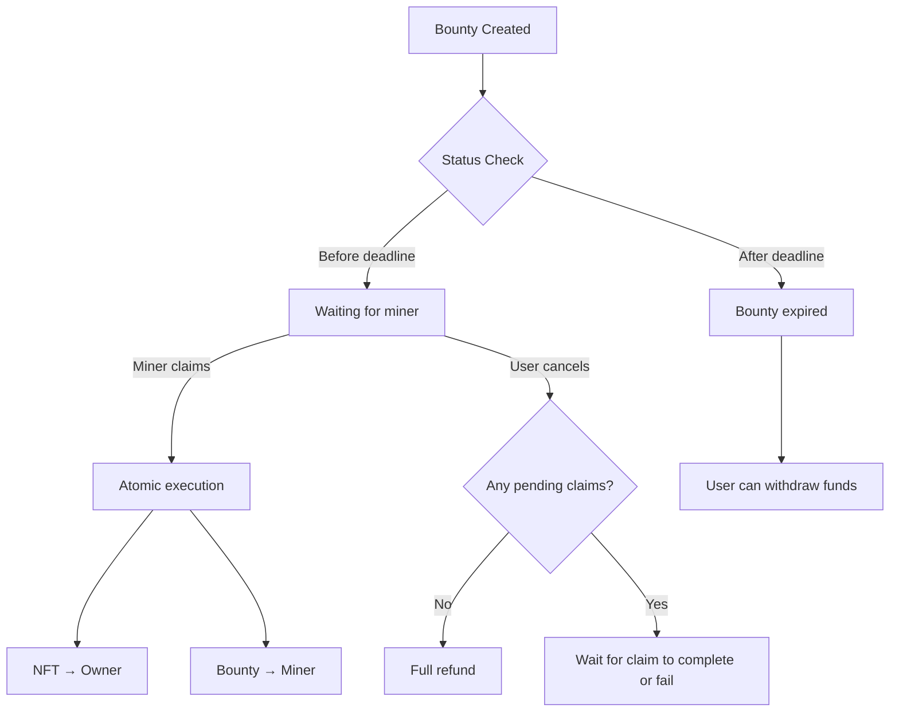

---

## 7. Resolver System

### 7.1 Architecture

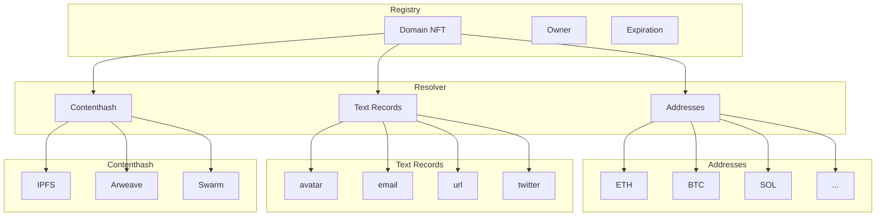

### 7.2 Record Types

| Type               | Description           | Examples                    |
| ------------------ | --------------------- | --------------------------- |
| **addr(coinType)** | Multi-chain addresses | ETH, BTC, SOL, ATOM...      |
| **text(key)**      | Text records          | avatar, email, url, twitter |
| **contenthash**    | Content hashes        | IPFS CID, Arweave TX        |

### 7.3 Setting Permissions

- Only the Owner can set resolver records
- Setting records **does not require PoW**
- Gas fees apply

---

## 8. $POWNS Token Economics

### 8.1 Token Utility

| Utility               | Description                          |
| --------------------- | ------------------------------------ |
| **Fee Discount**      | 20% discount when paying with $POWNS |
| **Bounty Settlement** | Standard currency for bounty market  |
| **Staking Rewards**   | Stake to share protocol revenue      |
| **DAO Governance**    | Proposal and voting rights           |

### 8.2 Token Distribution

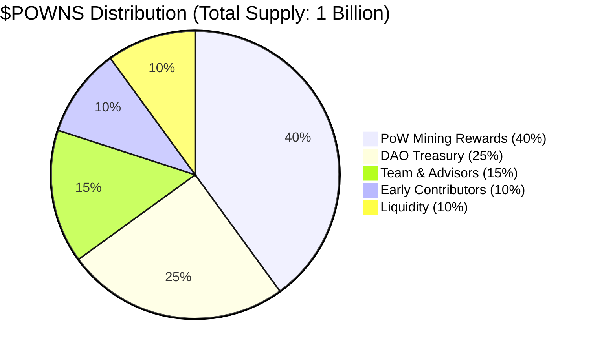

| Category           | Percentage | Amount | Vesting                      |
| ------------------ | ---------- | ------ | ---------------------------- |
| PoW Mining         | 40%        | 400M   | 10-year linear release       |
| DAO Treasury       | 25%        | 250M   | Governance unlocks           |
| Team               | 15%        | 150M   | 1-year cliff + 3-year linear |
| Early Contributors | 10%        | 100M   | TGE airdrop                  |
| Liquidity          | 10%        | 100M   | TGE launch                   |

### 8.3 Mining Rewards

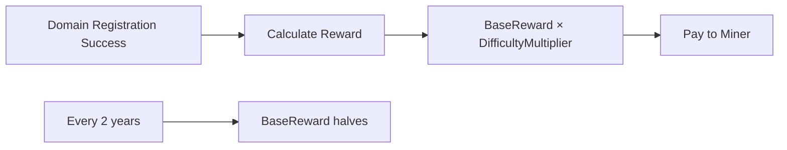

**Reward Formula**:

```
reward = baseReward × (difficulty / baseDifficulty)
```

- Short domain (high difficulty) → Higher $POWNS reward
- Long domain (low difficulty) → Lower $POWNS reward

### 8.4 Halving & Burning

| Mechanism   | Description                     |
| ----------- | ------------------------------- |
| **Halving** | baseReward halves every 2 years |
| **Burning** | 50% of fees permanently burned  |

### 8.5 Revenue Distribution

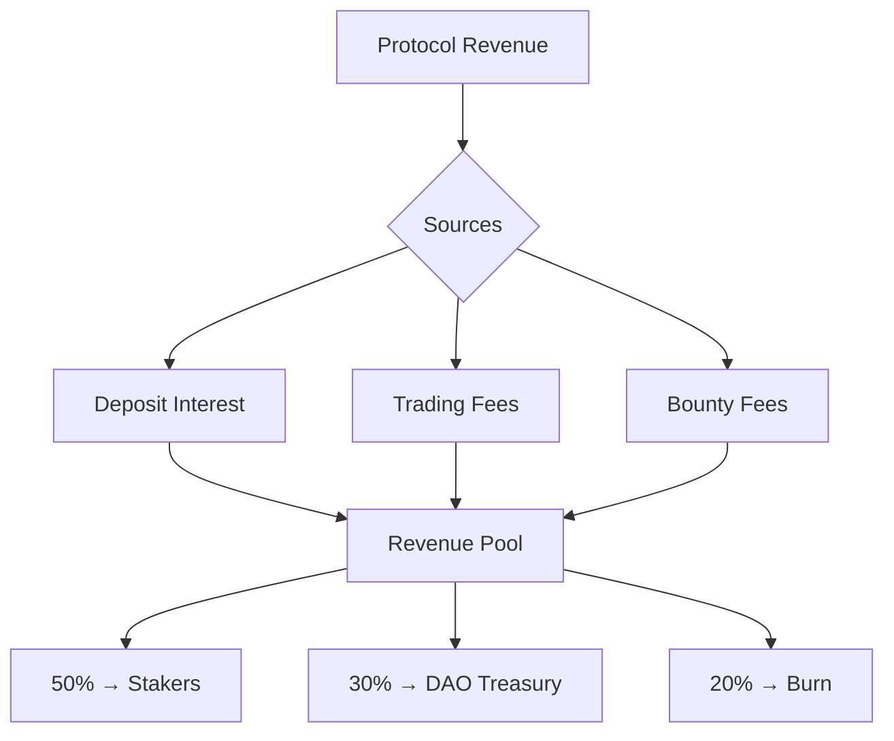

---

## 9. Governance

### 9.1 DAO Structure

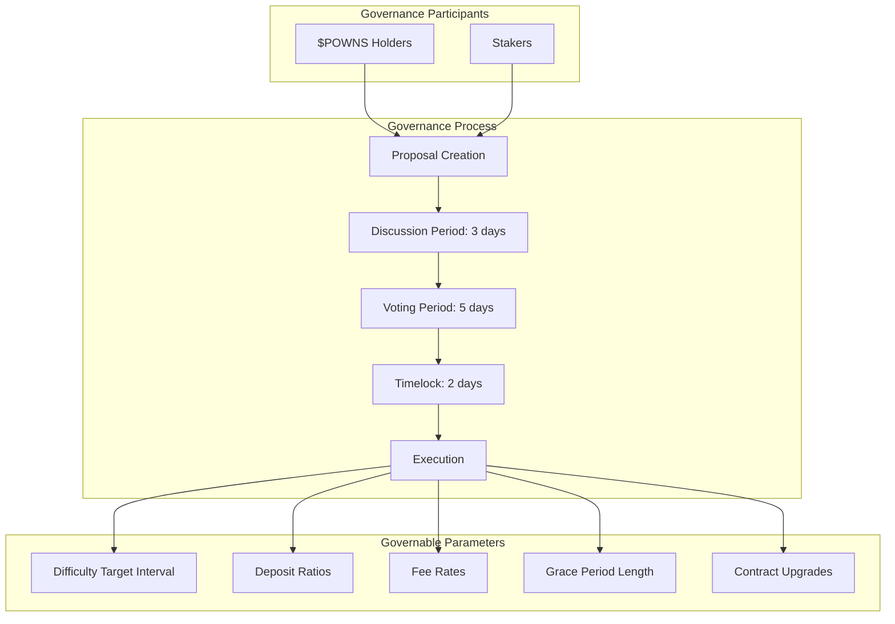

### 9.2 Voting Power

```
voting_power = staked_amount × time_multiplier

time_multiplier:
  - Staked < 1 month: 1.0x
  - Staked 1-6 months: 1.25x
  - Staked 6-12 months: 1.5x
  - Staked > 12 months: 2.0x
```

### 9.3 Proposal Thresholds

| Type                 | Proposal Threshold | Approval Threshold             |
| -------------------- | ------------------ | ------------------------------ |
| Parameter Adjustment | 0.1% of supply     | Simple majority + 10% quorum   |
| Contract Upgrade     | 1% of supply       | 2/3 supermajority + 20% quorum |
| Treasury Spending    | 0.5% of supply     | Simple majority + 15% quorum   |

---

## 10. Ecosystem Expansion

### 10.1 Trading Marketplace

Built-in domain trading marketplace supporting:

| Mode            | Description                     |
| --------------- | ------------------------------- |
| **Fixed Price** | List for sale at fixed price    |
| **Offers**      | Accept buyer offers             |
| **Auction**     | Set starting price and duration |

**Trading Fee**: 2.5%

- 50% → Stakers
- 30% → DAO
- 20% → Burn

### 10.2 Domain Leasing

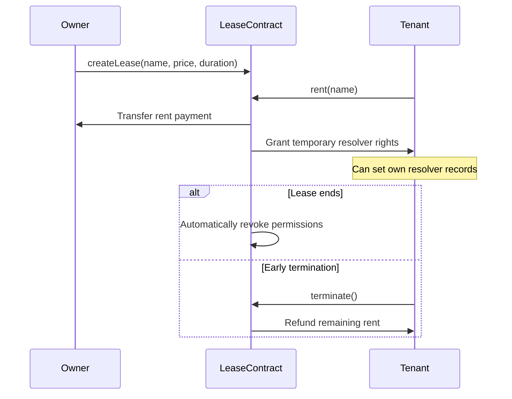

### 10.3 Subdomains

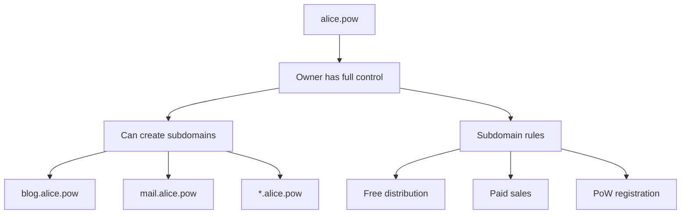

### 10.4 Multi-chain Deployment

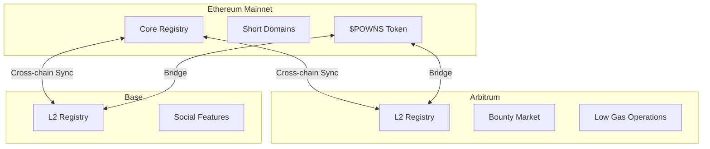

### 10.5 Wallet Integration

Goal: Native `.pow` suffix support in mainstream wallets

| Wallet   | Integration Method   |
| -------- | -------------------- |
| MetaMask | Snaps plugin         |
| Rainbow  | Native integration   |
| Phantom  | Cross-chain resolver |

---

## 11. Security Analysis

### 11.1 Attack Vectors & Defenses

| Attack                      | Risk   | Defense                                       |
| --------------------------- | ------ | --------------------------------------------- |
| **Front-running**           | High   | Hash bound to miner address                   |
| **Difficulty Manipulation** | Medium | DGW smooth adjustment + ±25% limit            |
| **Domain Squatting**        | Medium | Deposit + renewal cost + difficulty scaling   |
| **Sybil Attack**            | Low    | PoW is inherently Sybil-resistant             |
| **51% Hashrate Attack**     | Low    | Independent of mainchain consensus, low value |
| **Replay Attack**           | Low    | Hash includes chainId + contract address      |

### 11.2 Economic Security

| Risk                                | Defense                                          |
| ----------------------------------- | ------------------------------------------------ |
| Difficulty too low causing spam     | MIN_DIFFICULTY floor                             |
| Difficulty too high freezing system | MAX_DIFFICULTY ceiling + auto-decrease           |
| Locked bounty funds                 | Deadline mechanism + cancellation                |
| Lost deposits                       | Clear rules + voluntary release with full refund |

### 11.3 Contract Security

- OpenZeppelin standard libraries
- Multi-sig upgrade control
- Timelock delayed execution
- Planned: 2 independent security audits

---

## 12. Roadmap

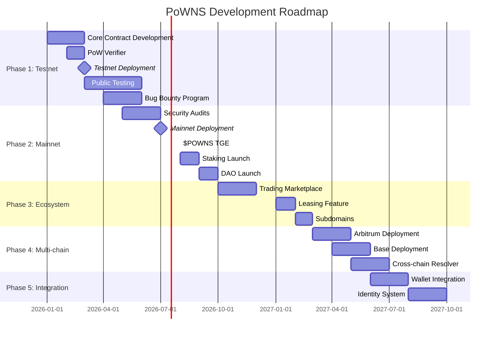

| Phase       | Timeline   | Milestones                                     |
| ----------- | ---------- | ---------------------------------------------- |
| **Phase 1** | Q1-Q2 2026 | Testnet deployment, public testing, bug bounty |
| **Phase 2** | Q3-Q4 2026 | Mainnet deployment, $POWNS TGE, DAO launch     |
| **Phase 3** | Q1 2027    | Trading marketplace, leasing, subdomains       |
| **Phase 4** | Q2-Q3 2027 | Multi-chain deployment, cross-chain resolver   |
| **Phase 5** | Q3-Q4 2027 | Wallet integration, identity system            |

---

## 13. Conclusion

PoW Name Service (PoWNS) introduces a new paradigm for name distribution:

1. **Fairness**: Computation replaces capital as the source of scarcity
2. **Decentralization**: Pure on-chain verification, no centralized control points
3. **Sustainability**: Renewal mechanism prevents permanent squatting
4. **Inclusivity**: Bounty market enables non-miners to participate
5. **Economic Closure**: $POWNS token connects all participants

We believe PoWNS will bring a fairer, more censorship-resistant option to Web3 identity infrastructure.

---

## Appendix

### A. Glossary

| Term             | Definition                                         |
| ---------------- | -------------------------------------------------- |
| **PoW**          | Proof of Work                                      |
| **DGW**          | Dark Gravity Wave, difficulty adjustment algorithm |
| **Bounty**       | Mining reward posted by users for miners           |
| **Resolver**     | Maps domain names to addresses                     |
| **Grace Period** | Time window after expiration allowing renewal      |

### B. Contract Addresses

_To be updated after testnet deployment_

### C. References

- [EIP-721: Non-Fungible Token Standard](https://eips.ethereum.org/EIPS/eip-721)
- [ENS Documentation](https://docs.ens.domains/)
- [Dark Gravity Wave](https://github.com/dashpay/dash/blob/master/src/pow.cpp)
- [Bitcoin Difficulty Adjustment](https://en.bitcoin.it/wiki/Difficulty)

---

_© 2025 PoWNS Labs. All rights reserved._
